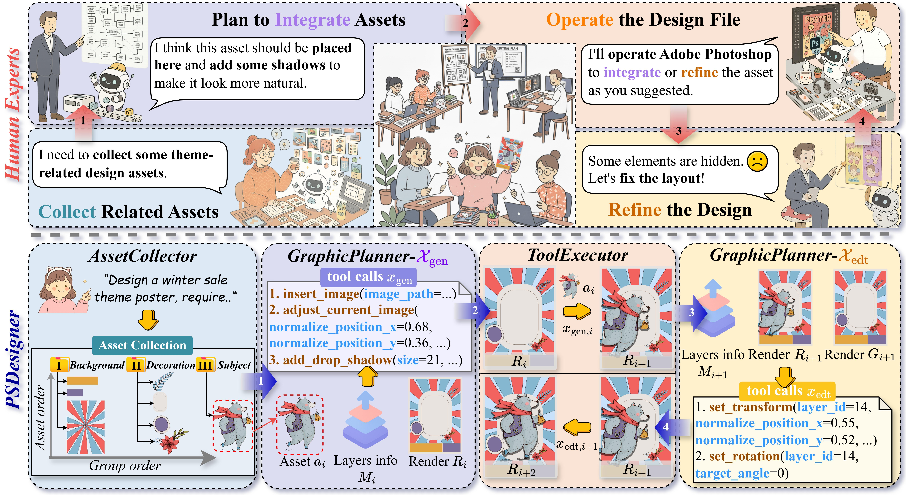
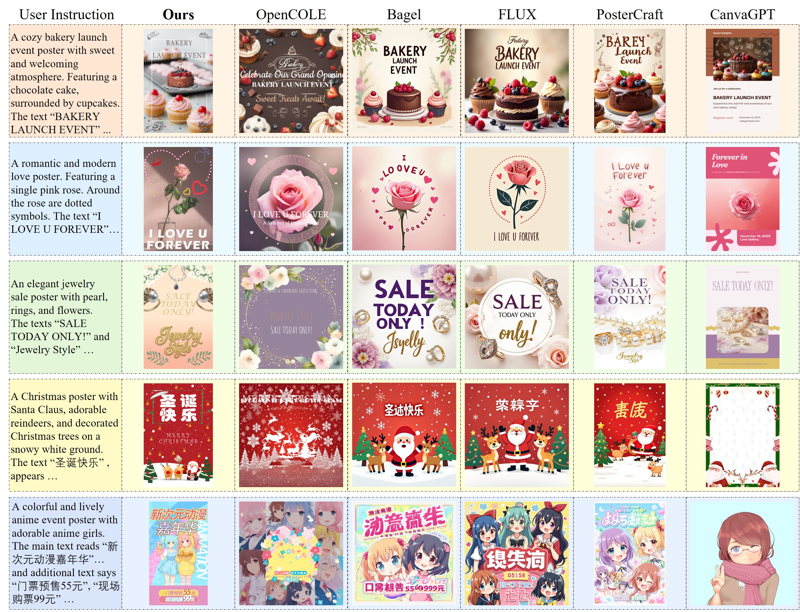
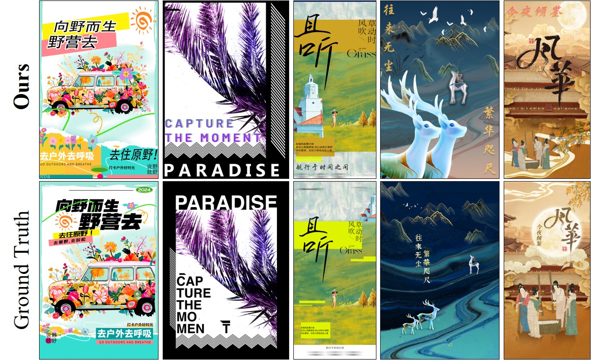

<h1 align="center">PSDesigner: Automated Graphic Design with a Human-Like Creative Workflow</h1>

<div align="center">
<a href='https://arxiv.org/abs/2603.25738'></a> &nbsp;&nbsp;&nbsp;&nbsp;
 <a href='https://henghuiding.com/PSDesigner'></a> &nbsp;&nbsp;&nbsp;&nbsp;
 <a href='https://modelscope.cn/datasets/song322/CreativePSD'></a> &nbsp;&nbsp;&nbsp;&nbsp;
<!-- <a href=""></a> &nbsp;&nbsp;&nbsp;&nbsp; -->
<!-- <a href=""></a> &nbsp;&nbsp;&nbsp;&nbsp; -->
<!--
<a href=""></a> &nbsp;&nbsp;&nbsp;&nbsp;
<a href=""></a> &nbsp;&nbsp;&nbsp;&nbsp; -->
</div>
<p align="center"><b>Xincheng Shuai<sup>1,*</sup>, Song Tang<sup>1,*</sup>, Yutong Huang<sup>1</sup>, Henghui Ding<sup>1,✉</sup>, Dacheng Tao<sup>2</sup></b></p>
<p align="center">* Equal Contribution, ✉ Corresponding Author</p>
<p align="center"><sup>1</sup>Fudan University, <sup>2</sup>Nanyang Technological University</p>


## 🎉 News
- [2026/03/26] Release the **CreativePSD dataset**.  [CreativePSD](https://modelscope.cn/datasets/song322/CreativePSD).
- [2026/02/21] PSDesigner is accepted to **CVPR 2026**. 👏👏


## 😊 Introduction
**PSDesigner** is an automated graphic design system that emulates the creative workflow of human designers, building upon multiple specialized components. First, *AssetCollector* collects theme-related assets based on user instructions. Then, *GraphicPlanner* infers the tool calls, while *ToolExecutor* executes them to manipulate design files, such as integrating new assets or refining inferior elements.



To endow GraphicPlanner with strong tool-use capabilities, we construct **CreativePSD**, which contains a large number of high-quality PSD files annotated with operation traces, covering a wide range of design scenarios and artistic styles. To the best of our knowledge, CreativePSD is the first design dataset based on the PSD (Adobe Photoshop Document) format, facilitating the model to learn expert design procedures.


## 🔧 Key Features
- **CreativePSD Dataset:** A curated dataset designed to enable models to learn the manipulation of PSD-format design files.
- **PSDesigner System:** A automated graphic design system that translates the user intention into PSD file.


## 👷‍♂️ Construction of CreativePSD
The following figure illustrates the construction pipeline of the CreativePSD: We first collect high-quality PSD files, while grouping the layers based on their underlying visual concepts. Then, we parse the PSD files and extract essential information, such as raw assets, metadata, and intermediate renders. Finally, we use the extracted data to construct the training data for asset integration and layer refinement.


## 🖥️ Visual Results
To demonstrate the effectiveness of our method, we conduct the following experiments. <b>(1).</b> We first evaluate the model’s ability to directly translate user intentions into final designs. 



<b>(2).</b> Then, we assess the model’s capability to perform graphic design composition based on the given assets. Specifically, we use the test data from Crello-v5 to evaluate the model performance in simple design scenarios. 


We further evaluate our method on copyright-free PSD files as a complement, featuring complex layer hierarchies.




## 📄 TODO List
<!-- - [√] Uploading the CreativePSD dataset -->
- Uploading the code of PSDesigner
- Uploading the weights of GraphicPlanner


## 💗 Citation
```bibtex
@inproceedings{shuai2026psdesigner,
    title={PSDesigner: Automated Graphic Design with a Human-Like Creative Workflow},
    author={Shuai, Xincheng and Tang, Song and Huang, Yutong and Ding, Henghui and Tao, Dacheng},
    booktitle={CVPR},
    year={2026}
}
```
